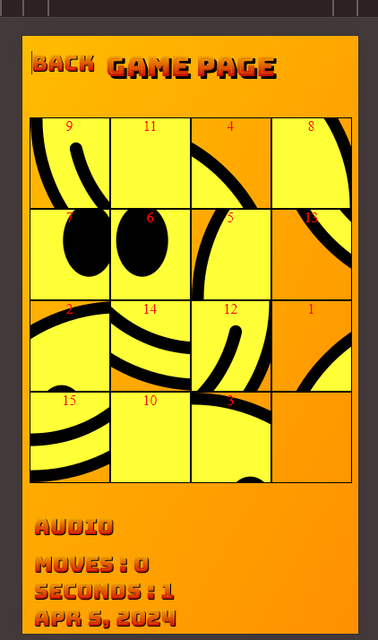

<!-- TABLE OF CONTENTS -->

# 📗 Table of Contents

- [📖 About the Project](#about-project)
  - [🛠 Built With](#built-with)
    - [Tech Stack](#tech-stack)
    - [Key Features](#key-features)
- [👥 Authors](#authors)
- [🤝 Contributing](#contributing)
- [⭐️ Show your support](#support)
- [🙏 Acknowledgements](#acknowledgements)
- [📩 Support & Feedback](#support)
- [📝 License](#license)

<!-- PROJECT DESCRIPTION -->

# 📖 About This Project 

> This project is built using Angular, leveraging the latest version along with SCSS for styling. It incorporates advanced features such as @if and @for directives, along with other functionalities like pipes and reusable components. Designed as part of a job interview challenge, it showcases meticulous styling and organization. The seamless routing ensures smooth navigation between pages without unnecessary page reloads. Utilizing RxJS, the project employs reactive programming akin to React Redux Toolkit, streamlining data management for enhanced code cleanliness and efficiency. Moreover, the implementation of @defer optimizes page loading, embracing lazy loading for improved performance.

# Sample Of Website 

## 🛠 Built With 

### Tech Stack 

  
Client

  <ul>
  <li><a href="https://en.wikipedia.org/wiki/HTML">Html</a></li>
  <li><a href="https://sass-lang.com/">scss</a></li>
  <li><a href="https://www.typescriptlang.org/">TypeScript</a></li>
  <li><a href="https://angular.io/">Angular</a></li>
  </ul>

<!-- Features -->

### Key Features 

- **[HTML ]**
- **[SCSS ]**
- **[TYPESCRIPT ]**
- **[ANGULAR ]**

(<a href="#readme-top">back to top</a>)

<!-- AUTHORS -->

## 👥 Authors 

👤 **Author1**

- GitHub: [@Ameer2000Mzori](https://github.com/Ameer2000Mzori)
- LinkedIn: [Ameer Ameen](https://www.linkedin.com/in/ameer-ameen-82314425b/)

(<a href="#readme-top">back to top</a>)

<!-- CONTRIBUTING -->

## 🤝 Contributing 

Contributions, issues, and feature requests are welcome! please dont forget to contact ameerapex496@gmail.com

Feel free to check the [issues page](../../issues/).

(<a href="#readme-top">back to top</a>)

<!-- SUPPORT -->

## ⭐️ Show your support 

If you like this project, don't hesitate to give it a star 😊.

(<a href="#readme-top">back to top</a>)

<!-- ACKNOWLEDGEMENTS -->

## 🙏 Acknowledgments 

(<a href="#readme-top">back to top</a>)

<!-- Support and feedback -->

## 📩 Support & Feedback 

If you have any feedback, please reach out to me at ameerapex496@gmail.com 📨

(<a href="#readme-top">back to top</a>)

<!-- LICENSE -->

## 📝 License 

This project is [MIT](./LICENSE) licensed.

_NOTE: we recommend using the [MIT license](https://choosealicense.com/licenses/mit/) - you can set it up quickly by [using templates available on GitHub](https://docs.github.com/en/communities/setting-up-your-project-for-healthy-contributions/adding-a-license-to-a-repository). You can also use [any other license](https://choosealicense.com/licenses/) if you wish._

(<a href="#readme-top">back to top</a>)

# ABOUT THIS PROJECT

This project is built using Angular, leveraging the latest version along with SCSS for styling. It incorporates advanced features such as @if and @for directives, along with other functionalities like pipes and reusable components. Designed as part of a job interview challenge, it showcases meticulous styling and organization. The seamless routing ensures smooth navigation between pages without unnecessary page reloads. Utilizing RxJS, the project employs reactive programming akin to React Redux Toolkit, streamlining data management for enhanced code cleanliness and efficiency. Moreover, the implementation of @defer optimizes page loading, embracing lazy loading for improved performance.

# SlidingPuzzle

This project was generated with [Angular CLI](https://github.com/angular/angular-cli) version 17.3.2.

## Development server

Run `ng serve` for a dev server. Navigate to `http://localhost:4200/`. The application will automatically reload if you change any of the source files.

## Code scaffolding

Run `ng generate component component-name` to generate a new component. You can also use `ng generate directive|pipe|service|class|guard|interface|enum|module`.

## Build

Run `ng build` to build the project. The build artifacts will be stored in the `dist/` directory.

## Running unit tests

Run `ng test` to execute the unit tests via [Karma](https://karma-runner.github.io).

## Running end-to-end tests

Run `ng e2e` to execute the end-to-end tests via a platform of your choice. To use this command, you need to first add a package that implements end-to-end testing capabilities.

## Further help

To get more help on the Angular CLI use `ng help` or go check out the [Angular CLI Overview and Command Reference](https://angular.io/cli) page.
